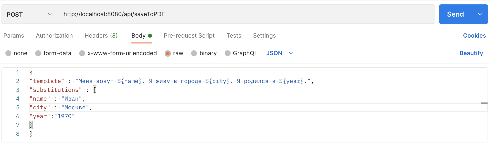
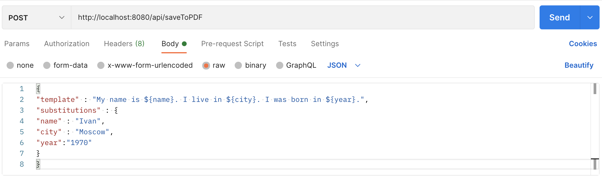
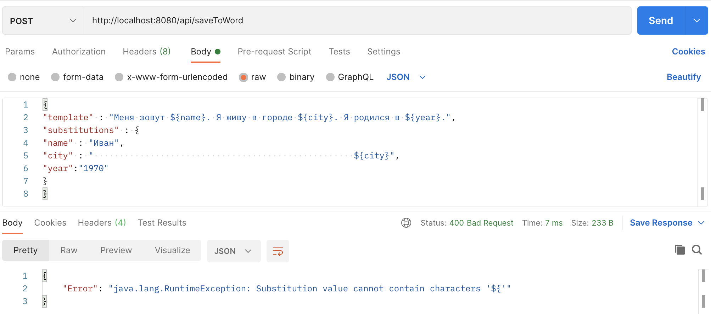
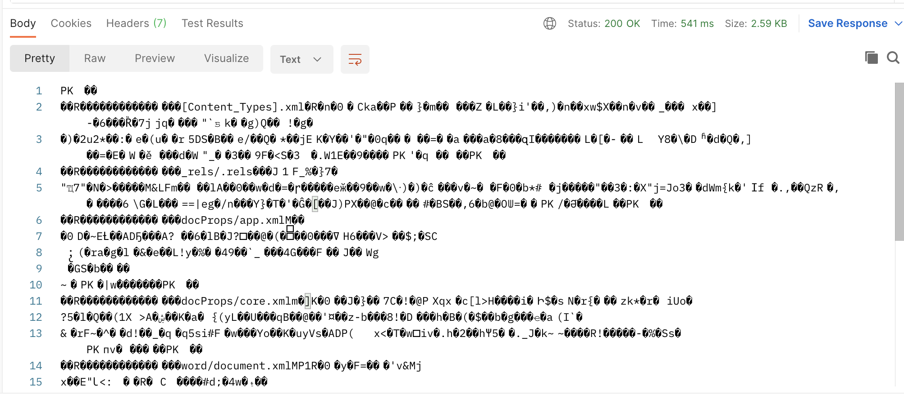
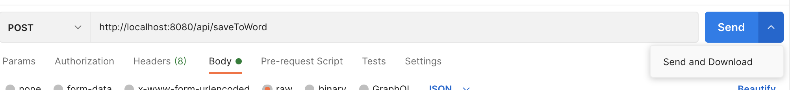
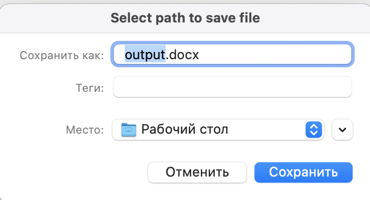
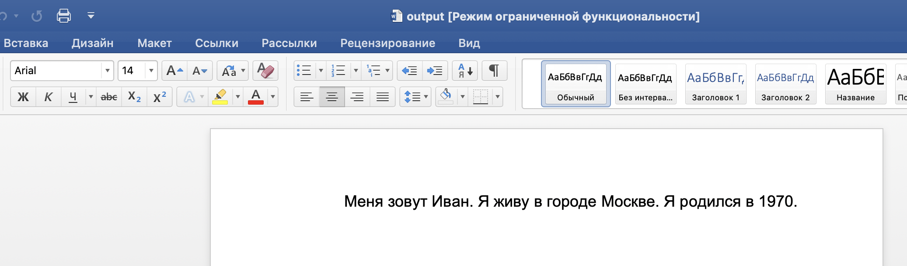

# PDFandWordTemplateEngine

### REST веб-сервис шаблонизатор с сохранением результата в PDF или MS Word

### Технологии
* Spring Boot
* iText для создания PDF документов
* Apache POI для создания MS Word документов

### Что именно делает веб-сервис
Сервис принимает на вход JSON  
Пример JSON'a:
```
{
"template" : "Меня зовут ${name}. Я живу в городе ${city}. Я родился в ${year}.",
"substitutions" : {
"name" : "Иван",
"city" : "Москве",
"year":"1970"
}
}
```
Результат обработки шаблона отправляется в виде PDF или DOCX.  
Пример результата обработки:
```
Меня зовут Иван. Я живу в городе Москве. Я родился в 1970.
```

### API

* Сохранение в формате PDF



* Saving to PDF format



* Сохранение в формате DOCX


* Пример запрещённых входных данных



### Как скачать файлы в Postman'e

Если просто нажать кнопку 'Send', то результат не будет скачан в файл,  
а будет записан в тело ответа.

Пример результата:



Чтобы скачать файл, можно нажать на стрелку рядом с кнопкой 'Send' и  
затем выбрать 'Send and Download'  

  

Результат:  

  

Скачанный DOCX документ:  



